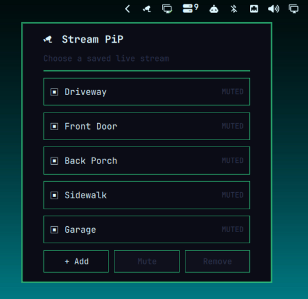
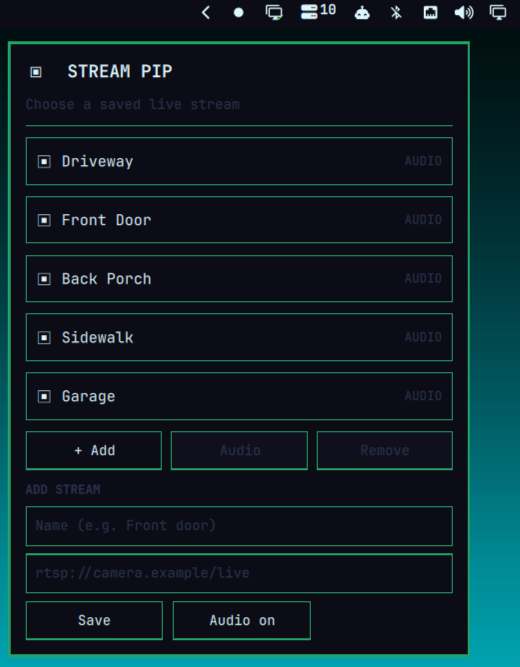
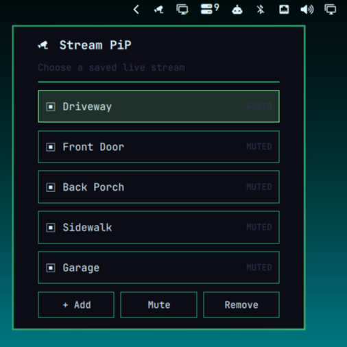

# Omarchy StreamPiP

An Omarchy bar widget and RTSP/RTSPS launcher for a low-latency mpv
picture-in-picture window.

## Screenshots

Choose and launch a saved stream from the compact popup:



Add a named RTSP/RTSPS stream directly from the popup:



Select a stream to toggle its audio between **Mute** and **Audio**:



## Controls

- `SUPER + SHIFT + ALT + L`: open the saved-stream popup beneath the focused
  StreamPiP bar icon. Select a stream to launch it, then use **+ Add** to save
  another RTSP/RTSPS URL or **Remove** to delete the selected stream.
- With a stream selected, **Mute** turns its audio off; **Audio** restores it.
  The setting is remembered per stream.
- `SUPER + Right Mouse drag`: resize the stream window (native Omarchy behavior).
- `SUPER + W`: close the active Stream PiP window.
- `SUPER + SHIFT + ALT + W`: close any StreamPiP window, including one that
  failed to receive keyboard focus.
- `SUPER + SHIFT + ALT + T`: reset every active StreamPiP into a compact,
  flush 320×180 thumbnail group on the focused monitor.
- `SUPER + T`: re-snap StreamPiPs instead of tiling them. It keeps Omarchy's
  normal floating/tiled toggle for every other app.
- Left-drag any attached StreamPiP thumbnail to move its group. Shift-left-drag
  peels one thumbnail away. Drag a peeled PiP near an edge to reattach it while
  preserving each PiP's individual size.
- Shift-right-drag a StreamPiP to resize only that PiP. Attached PiPs may keep
  intentionally different sizes; use `SUPER + SHIFT + ALT + T` to reset the
  whole cluster to compact defaults.

### Arrange PiPs

1. **Move a group:** left-drag any attached PiP. Every PiP in that attachment
   group moves together without changing its arrangement.
2. **Peel one away:** Shift-left-drag a PiP. It becomes independent and follows
   the pointer until you release it.
3. **Snap it back:** move a peeled PiP within about 48px of another PiP's top,
   bottom, left, or right edge, then release. StreamPiP aligns the nearest
   compatible edges exactly and preserves both PiPs' individual sizes.
4. **Resize one PiP:** Shift-right-drag from the corner you want to adjust.
   The opposite corner stays fixed, the 16:9 aspect ratio is preserved, and
   neighboring PiPs are not resized.
5. **Start over:** press `SUPER + SHIFT + ALT + T` to attach every active PiP
   and restore the compact 320×180 thumbnail grid.

The first PiP opens at 600×338 in the lower-right corner. Active floating PiPs
automatically reflow after a stream opens or closes, preserve their aspect ratio,
and stay pinned across workspaces. Detached streams keep their own position;
attached streams reflow together whenever a stream opens or closes. Saved stream
names and URLs are stored
with owner-only permissions at `~/.config/omarchy/live-stream-pip/streams.tsv`.
This is intentional so the hotkey can reuse streams, but URLs may contain RTSP
credentials.

When a stream launches, its URL is provided to mpv through a temporary
owner-only playlist file, not the process command line.

## Install from a repository

```bash
omarchy plugin add https://github.com/byronroark/omarchy-streampip.git --enable
```

The bar icon opens a compact, Omarchy-themed picker directly beneath the icon.
It requires `mpv`, which is part of the standard Omarchy environment.

After running the installer, search for **StreamPiP** in Omarchy Apps to launch
it from the dome-camera icon.

## Optional PiP hotkey and window rule

Run the included installer after adding the plugin to enable a dedicated
`SUPER + SHIFT + ALT + L` hotkey and the pinned lower-right PiP window rule:

```bash
./install.sh
```

This uses only user-owned files under `~/.local/bin` and `~/.config/hypr`.

## Remove

```bash
./uninstall.sh
```

To remove the bar widget and its installed source:

```bash
omarchy plugin remove byronroark.streampip
```
